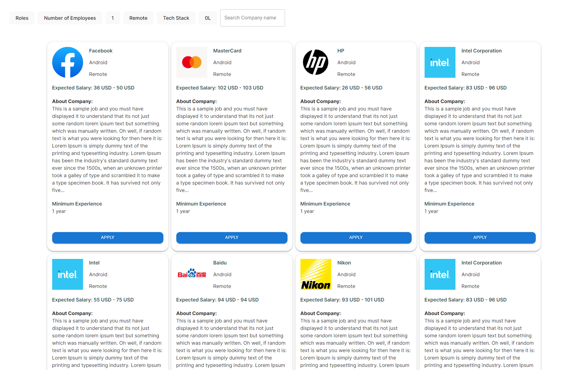

<h2 align="center">
  A Candidate Application Platform
</h2>

<div align="center">
	
</div>

<br/>

<center>

[](https://forthebadge.com) &nbsp;
[](https://forthebadge.com) &nbsp;
[](https://forthebadge.com) &nbsp;
</center>

## Built With

A Candidate Application Platform built for the weekday assessment.<br/>

This project was built using these technologies.

- React.js
- Vite
- Node.js
- Material UI
- CSS3
- VsCode

## Features

**🎨 Styled with Material UI and CSS with easy to customize colors**

**📱 Fully Responsive**

## Getting Started

Clone down this repository. You will need `node.js` and `git` installed globally on your machine.

## 🛠 Installation and Setup Instructions

```bash
  npm i
  npm run dev
```

Runs the server in the development mode.\
Open [http://localhost:5173](http://localhost:5173) to view it in the browser.
Consecutively, you can also see it running in your terminal.

## Usage Instructions

Open the project folder and Navigate to `/src/components/`. <br/>
You will find all the components used and you can edit your information accordingly.

All the types for the Filter Components can be found in the `/src/components/Filters/Props.ts` file.

The `JobCard` component takes params of `Job` type, which can be found in `/src/jobData.d.ts` file.

The App also uses a `JobData` object to store the fetched jobs and their count. That can be found in `/src/jobData.d.ts` as well.

The Main code is there on `/src/App.tsx`.<br/>
You can modify that to make changes and the browser shall reflect them.
